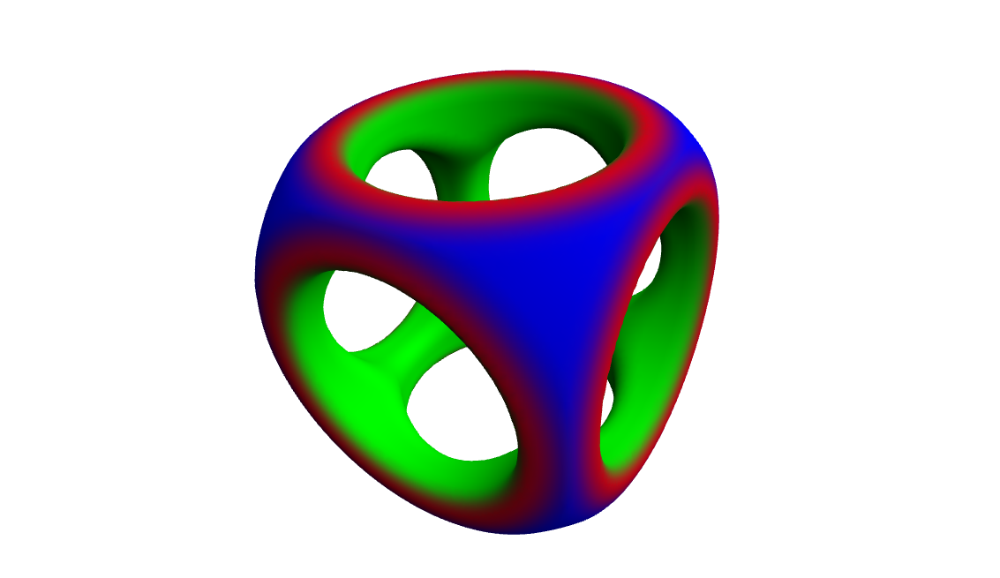
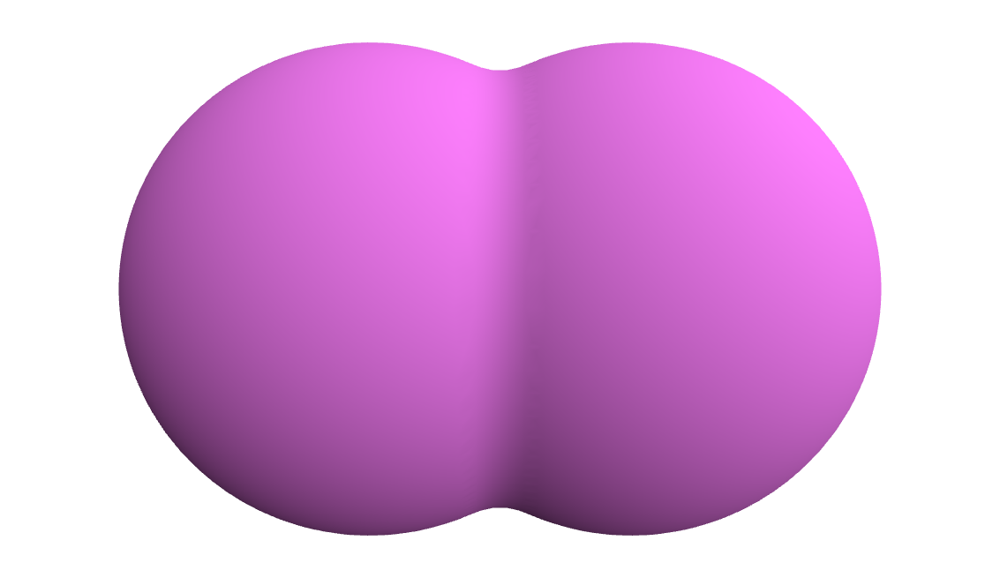
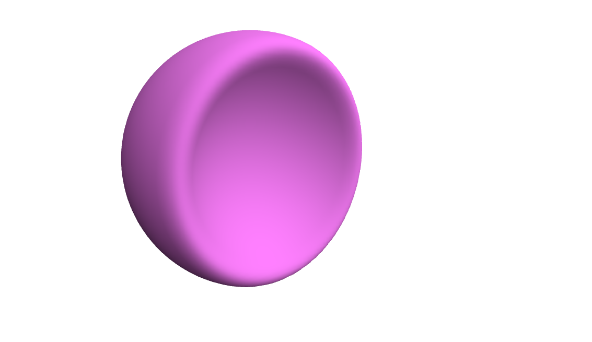
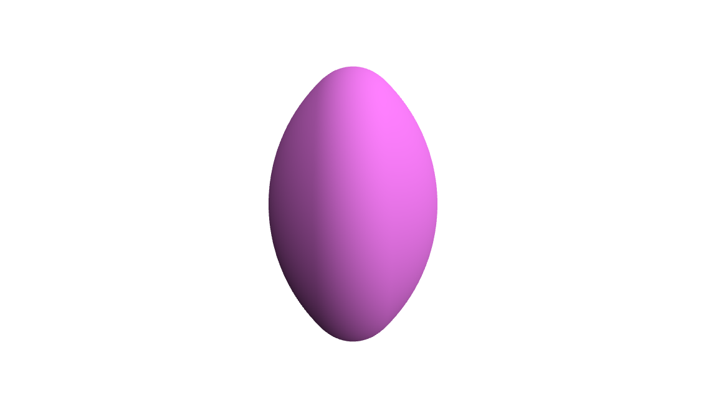
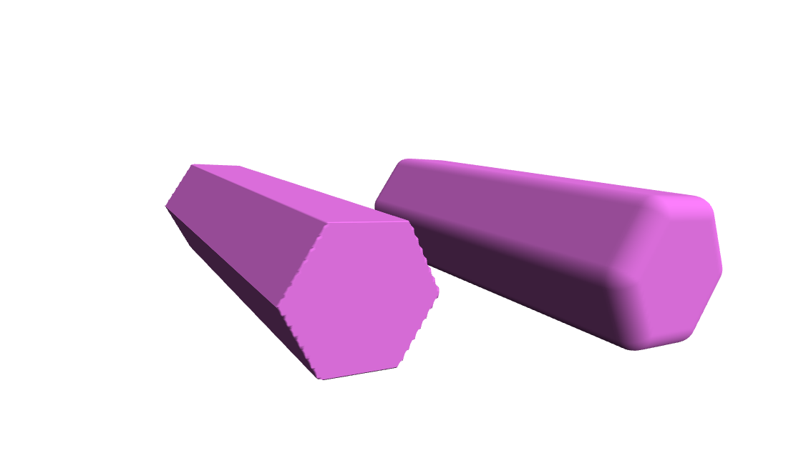
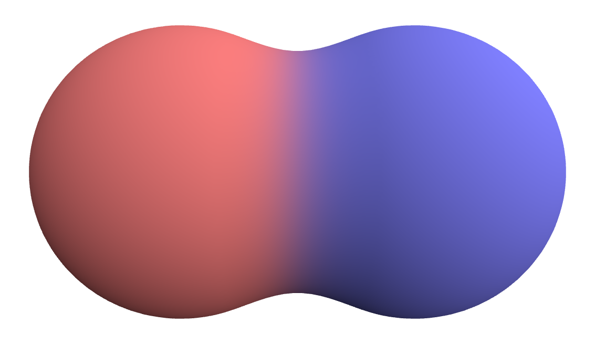

# sdf-csg

Generate meshes from signed distance functions and constructive solid geometry operations. This library is heavily based upon [Inigo Quilez's](https://iquilezles.org/index.html) [3D SDFs](https://iquilezles.org/www/articles/distfunctions/distfunctions.htm) article.

## Example

```ts
import { Box, Sphere, CappedCylinder } from "sdf-csg";

const sdf = new Sphere(1)
  .setUserData([0, 0, 1])
  .smoothIntersect(new Box(0.75, 0.75, 0.75).setUserData([1, 0, 0]), 0.1)
  .smoothSubtract(
    new CappedCylinder(1, 0.5)
      .smoothUnion(new CappedCylinder(1, 0.5).rotateX(Math.PI / 2), 0.1)
      .smoothUnion(new CappedCylinder(1, 0.5).rotateZ(Math.PI / 2), 0.1)
      .setUserData([0, 1, 0]),
    0.1
  );

const mesh = sdf.generateMesh([64, 64, 64], 0.2);
```

<p align="center">
  
</p>

[Live Demo](https://wwwtyro.github.io/sdf-csg)

> Note: this project is very much a work in progress. There may be significant changes to the API until the 1.0.0 semantic version is released.

## Primitives

All of these return a new SDF.

```ts
const sdf = new Box(width: number, height: number, depth: number)
const sdf = new Sphere(radius: number)
const sdf = new BoxFrame(width: number, height: number, depth: number,  edge: number)
const sdf = new Torus(majorRadius: number,  minorRadius: number)
const sdf = new CappedTorus(majorRadius: number,  minorRadius: number,  angle: number)
const sdf = new Link(majorRadius: number,  minorRadius: number,  length: number)
const sdf = new Cone(angle: number,  height: number)
const sdf = new HexagonalPrism(radius: number,  length: number)
const sdf = new Capsule(pointA: number[],  pointB: number[],  radius: number)
const sdf = new CappedCylinder(length: number,  radius: number)
const sdf = new CappedCone(length: number,  radius1: number,  radius2: number)
const sdf = new SolidAngle(angle: number, radius: number)
```

## Operations

All of these return a new SDF.

```ts
sdf.union(sdf: SDF)
sdf.subtract(sdf: SDF)
sdf.intersect(sdf: SDF)
sdf.smoothUnion(sdf: SDF, smoothness: number)
sdf.smoothSubtract(sdf: SDF, smoothness: number)
sdf.smoothIntersect(sdf: SDF, smoothness: number)
sdf.translate(x: number, y: number, z: number)
sdf.rotate(quat: number[])
sdf.rotateX(radians: number)
sdf.rotateY(radians: number)
sdf.rotateZ(radians: number)
sdf.scale(amount: number)
sdf.round(amount: number)
```

### Example: `smoothUnion`

```ts
const sdf = new Sphere(1)
  .translate(-0.5, 0, 0)
  .smoothUnion(new Sphere(1).translate(0.5, 0, 0), 0.1)
  .setUserData([1, 0.5, 1]);
```

<p align="center">
  
</p>

### Example: `smoothSubtract`

```ts
const sdf = new Sphere(1)
  .translate(-0.5, 0, 0)
  .smoothSubtract(new Sphere(1).translate(0.5, 0, 0), 0.2)
  .setUserData([1, 0.5, 1]);
```

<p align="center">
  
</p>

### Example: `smoothIntersect`

```ts
const sdf = new Sphere(1)
  .translate(-0.5, 0, 0)
  .smoothIntersect(new Sphere(1).translate(0.5, 0, 0), 0.2)
  .setUserData([1, 0.5, 1]);
```

<p align="center">
  
</p>

### Example: `round`

```ts
const sdf = new HexagonalPrism(0.25, 1)
  .translate(-0.75, 0, 0)
  .union(new HexagonalPrism(0.25, 1).translate(0.75, 0, 0).round(0.1))
  .setUserData([1, 0.5, 1]);
```

<p align="center">
  
</p>

## User data

You can assign "user data" - an array of numbers - to components of your SDF. These are interpolated across the SDF and returned by the `generateMesh` function. Here's an example using them to interpolate color across the surface of the mesh, but you could imagine using them for other purposes, such as values for use with physically based rendering, etc.

```ts
const sdf = new Sphere(1)
  .setUserData([1, 0.5, 0.5])
  .translate(-0.75, 0, 0)
  .smoothUnion(new Sphere(1).setUserData([0.5, 0.5, 1]).translate(0.75, 0, 0), 0.5);
```

<p align="center">
  
</p>

## Mesh generation

```ts
const mesh = sdf.generateMesh(resolution: [number, number, number], padding: number);
```

Returns a `Mesh`:

```ts
interface Mesh {
  positions: number[][];
  normals: number[][];
  cells: number[][];
  userdata: number[][] | null;
}
```

## Road map

- The current isosurface extractor generates poor results for edges and corners. Write or use a different one for better results.
- Isosurface extraction is slow. Speed it up (perhaps the SDF data could be used to skip large chunks of the grid?).
- The bounds of the SDF are determined analytically, and it's a little buggy (e.g., when using the "smooth" operators), requiring the use of padding when generating the mesh. Some options:
  - Fix the bugs.
  - Determine the bounds numerically, using the value of the SDF to accelerate it.
- Add more primitives.
- Add more operators.

## Credits

This library is heavily based upon [Inigo Quilez's](https://iquilezles.org/index.html) [3D SDFs](https://iquilezles.org/www/articles/distfunctions/distfunctions.htm) article.
